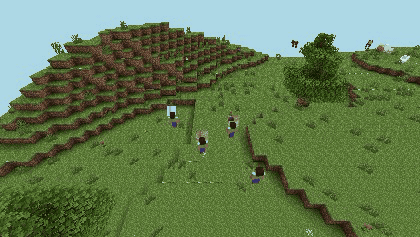

# esp32-minecraft-server

A Minecraft Java Edition server that runs on an ESP32. It speaks the 1.16.5
protocol (754), so an unmodified client can join. The world is generated on the
chip and stored on the network through a **Network Block Device** (NBD) in a
compact, crash-safe binary format, so it is not limited by the board's flash.

This is a rewrite of [nikisalli/esp32-minecraft-server](https://github.com/nikisalli/esp32-minecraft-server).
The server core (`lib/mcore`) is portable C++17. The same code also builds as a PC
server, which runs the unit and end-to-end tests. The firmware itself runs in an
emulated ESP32-S3 for debugging, benchmarking and load tests ([docs/QEMU.md](docs/QEMU.md)).



*The firmware running on an emulated ESP32-S3 (QEMU): four players jump into unexplored
land, the terrain appears chunk by chunk as the device generates it, and they walk into
fresh terrain. Recorded with `node test/record_gif.js` (the browser-based viewer adds
its own delay, see [docs/QEMU.md](docs/QEMU.md#recording-a-gif)).*

## Features

- **Protocol 1.16.5**, offline mode:
  - server list with MOTD, player count and icon
  - zlib-compressed packets
  - vanilla registries and tags, keep-alive, tab list with ping
- **Terrain:** seeded generator with 25 biomes (oceans, rivers, beaches, deserts,
  badlands, jungles, taigas, mountains, ...), caves, ores and six tree types.
  Superflat and void worlds are also available. Chunks are streamed nearest-first
  within the view distance.
- **Lighting:** sky light and block light with vanilla light opacity.
- **Survival:**
  - digging with server-side timing and tool tiers, drops and item pickup
  - health, hunger, saturation, fall damage, drowning, lava and fire, death and respawn, XP
- **Items and containers:**
  - player inventory, the vanilla crafting recipes (2x2 and 3x3), chests, trapped chests, barrels
  - furnaces, smokers and blast furnaces that smelt with fuel
  - beds (respawn point), signs, doors, trapdoors, levers, buttons, buckets, bows, food
- **World simulation:**
  - flowing water and lava, falling sand and gravel
  - crops, sugar cane and cactus growth, grass spreading
  - correct shapes for stairs and fences, support checks (plants, torches, ...)
- **Mobs:**
  - passive: cows, pigs, sheep, chickens
  - hostile: zombies, skeletons (they shoot), spiders, creepers (they explode)
  - hostile mobs burn in daylight; mobs spawn naturally, take damage and drop loot; PvP
- **Commands:** `help list msg tell w me seed spawn tps lag storage` for everybody;
  `gamemode tp give clear time weather kill setworldspawn spawnpoint say difficulty xp
  heal feed summon setblock fill op deop kick stop fly workers` for operators. Tab
  completion works.
- **Persistence** on any NBD server: chunks you changed, player data (position,
  inventory, health, XP, spawn point) and world metadata. Chunks that were never
  modified are not stored at all, because they are regenerated from the seed.
- **Two worker threads**, one per core, generate, light and compress chunks, so the
  game loop stays responsive (see [Threads](#threads)).

## Hardware

**A board with at least 8 MB of PSRAM is required.** Chunks, packet buffers and the
worker threads' buffers live in PSRAM, and the firmware refuses to start without it.

| board | PlatformIO environment |
|---|---|
| ESP32-S3 N8R8 / N16R8 (octal PSRAM), e.g. ESP32-S3-DevKitC-1 N8R8: recommended | `esp32-s3` (default) |
| ESP32 WROVER-E with 8 MB PSRAM (the classic ESP32 maps 4 MB of it) | `esp32-wrover` |
| virtual ESP32-S3 in QEMU | `esp32s3-qemu`, see [docs/QEMU.md](docs/QEMU.md) |

With 8 MB of PSRAM the ESP32-S3 build serves up to 10 players with a view
distance of up to 8 and keeps about 200 chunks resident.

## Quick start

1. **Start an NBD server** that holds the world, on any machine in your network
   (a PC, NAS or Raspberry Pi):

   ```sh
   # the bundled server (Python 3, no dependencies); the image is created sparse
   python3 tools/nbd_server.py --file world.img --size 2G --port 10809

   # or any standard NBD server
   nbdkit -f file world.img                      # truncate -s 2G world.img first
   qemu-nbd -t -f raw -p 10809 world.img
   nbd-server 10809 /path/to/world.img
   ```

   The export size sets the world border (`MC_WORLD_RADIUS`, at most 64 chunks):
   512 MiB fits 31 chunks (496 blocks) in every direction, 1 GiB fits 45 and 2 GiB
   fits 63. The image is sparse, so it only uses as much disk as the world needs,
   typically a few MB.

2. **Configure:** copy `include/config_edit_me.h` to `include/config.h` and set your
   WiFi credentials, `NBD_HOST` (the machine from step 1) and the server options
   (MOTD, game mode, difficulty, operators, whitelist, seed, world type, ...).

3. **Build and flash** with [PlatformIO](https://platformio.org/):

   ```sh
   pio run -e esp32-s3 -t upload && pio device monitor
   ```

4. **Connect** with Minecraft 1.16.5 to the IP address printed on the serial
   console, or to `esp32-minecraft.local` (mDNS).

Without `NBD_HOST` the server still runs, but the world resets on every reboot.

## Storage format

The world lives on the NBD export as raw binary records. NBD transfers fixed-size
binary blocks with almost no protocol overhead, and every NBD server can serve a
plain file:

```
0       superblock copy A  \  alternate writes with a sequence number;
512     superblock copy B  /  the newest valid copy wins
4096    player table       hashed by UUID, 512 bytes per player
64 KiB  chunk area         two slots per chunk inside the world border
```

- A chunk save goes to the older of its two slots, with a CRC32 and zlib
  compression. An interrupted write, for example from a power cut, never destroys
  the last good copy.
- Reads are pipelined: the storage lookups of all chunks the players need in a
  tick share one round trip. Writes are posted, so their replies are collected
  later. The client reconnects after network errors.
- The world autosaves every 60 s and saves on `/stop`.

## Threads

```
core 1:  server task (game loop, 20 TPS)  |  worker 1 (lower priority: runs while the loop sleeps)
core 0:  WiFi / lwIP                      |  worker 0
```

The game loop handles packets, game logic and storage I/O. Everything CPU-heavy
runs on the workers ([`lib/mcore/src/mc/jobs.h`](lib/mcore/src/mc/jobs.h),
[`server/chunk_jobs.h`](lib/mcore/src/mc/server/chunk_jobs.h)):

- generating chunks and decoding stored ones
- computing light and building and compressing the chunk and light packets
- re-lighting after block changes
- encoding and compressing chunk saves

Jobs work on snapshots (a copy of the chunk plus its neighbours' border heights),
never on the live world. Their results are applied by the game loop. A chunk with
a job in flight is not evicted, and a packet prepared from a chunk that changed in
the meantime is rebuilt.

The queue has four priority classes, each with a waiting budget: urgent (0 ms),
high (100 ms), normal (500 ms) and background (3 s). A job's deadline is the time it
was queued plus its budget, and the workers always take the job with the earliest
deadline. Urgent work therefore goes first, but a waiting background job's deadline
eventually comes before that of every newly queued urgent job, so a steady stream of
urgent work cannot starve it.

- urgent: the chunks under and next to a player (distance ≤ 1)
- high: chunks within 3 chunks, and re-lighting after block changes
- normal: the rest of the view distance
- background: saves

Loads and sends are promoted when a player comes closer and cancelled when every
player has moved out of range. Loads go through an admission step: a few slots are
reserved for urgent loads, and every player gets a share, so one fast player
cannot take every slot. `/workers` shows the queue per class and the longest wait.

Measured on the emulated ESP32-S3 ([docs/QEMU.md](docs/QEMU.md)):

- A new chunk costs about 52 ms of CPU time: generation 34 ms, light 8.5 ms,
  compression 8 ms. That is more than a whole 50 ms tick of one core.
- With players exploring new terrain, the two workers cut the longest game-loop
  stalls from 250–400 ms to roughly 25–90 ms and deliver about 1.5–2× as many
  chunks per second.
- With the priority queue instead of a single FIFO queue (6 players, 2 workers,
  3 runs each), the chunk under a player who jumps into new terrain arrives after
  about 680 ms instead of 1020 ms, all nine chunks around them after about 1.2 s
  instead of 4.3 s, and the throughput is about 10% higher (22 vs. 20 chunks/s).

`/workers N` changes the pool size at runtime (0 runs everything on the game loop).
`/lag` shows what the slowest recent loop iteration spent its time on.

## PC build and tests

```sh
make -C host test                         # unit tests (67 tests)
make -C host server                       # PC server: host/build/mcserver --help
host/build/mcserver --nbd 127.0.0.1:10809 # the same server, e.g. against tools/nbd_server.py
make -C host SAN=1 test                   # AddressSanitizer + UndefinedBehaviorSanitizer
make -C host TSAN=1 test                  # ThreadSanitizer (workers vs. game loop)

cd test && npm install                    # end-to-end tests with mineflayer bots
node run_all.js                           # smoke, gameplay, persistence, mobs and load
NBD_IMPL=nbdkit node persistence.js       # persistence against nbdkit (or qemu-nbd)
node qemu_load.js                         # load test of the firmware in QEMU
node record_gif.js                        # the GIF above (prismarine-viewer + headless Chromium)
```

`tools/gen_data.js` regenerates the registries (`lib/mcore/src/mc/data/`) from
minecraft-data. `tools/fetch_vanilla.sh` fetches the vanilla server's data reports
to cross-check them.

## Compared with vanilla 1.16.5

✅ like vanilla · 🟡 partly or simplified · ❌ missing. [docs/ROADMAP.md](docs/ROADMAP.md)
describes what the bigger gaps (Redstone, the Nether, ...) would take.

**Protocol and server**

| | | |
|---|---|---|
| Clients | ✅ | 1.16.4 / 1.16.5 (protocol 754); server list with MOTD, player count and icon; compression |
| Authentication | ❌ | offline mode only: no Mojang login, encryption or skins (use the whitelist) |
| Players, view | 🟡 | up to 10 players (ESP32-S3) or 8 (WROVER); view distance up to 8 chunks (vanilla: 32); mobs, crops and fluids are simulated within 3 chunks of a player |
| World size | 🟡 | world border at most 64 chunks (1024 blocks) from the centre, smaller on small NBD exports (vanilla: 30 million blocks); height 0-255 as in vanilla |
| Administration | 🟡 | operators and whitelist from the config, `/op`, `/deop`, `/kick`, `/stop`; no bans, gamerules, RCON, query or resource packs |
| Mods | ❌ | no data packs or plugins |

**World generation**

| | | |
|---|---|---|
| Terrain | 🟡 | its own seeded generator: the same seed always gives the same world here, but not the world vanilla generates for that seed |
| Biomes | 🟡 | 25 biomes (the 1.16.5 registry has 79) |
| Caves, ores, trees | 🟡 | noise caves and caverns, ores, six tree types; no ravines, lakes, dungeons or other features |
| Structures | ❌ | no villages, mineshafts, strongholds, temples, monuments, ... |
| Dimensions | ❌ | overworld only: no Nether, no End |
| Vanilla worlds | ❌ | cannot import or export Anvil (region file) worlds |

**Blocks and world simulation**

| | | |
|---|---|---|
| Placing and breaking | ✅ | block states and shapes (stairs, fences, doors, ...), survival digging times, tool tiers, drops |
| Lighting | 🟡 | sky and block light with vanilla opacity, but block light does not cross chunk borders |
| Fluids | 🟡 | water and lava flow, sources, lava + water makes obsidian or cobblestone; simplified |
| Gravity | ✅ | sand, gravel, concrete powder, anvils fall |
| Growth | 🟡 | crops, sugar cane, cactus and grass grow; no leaf decay, fire spread, or snow and ice in cold weather |
| Redstone | ❌ | levers and buttons only switch themselves, repeaters and comparators only change their setting: nothing carries power; no pistons, observers, hoppers, droppers, dispensers or rails |
| TNT | 🟡 | ignited with flint and steel; explosions damage players and terrain |
| Block entities | 🟡 | chests, barrels, furnaces, smokers, blast furnaces and signs; no hoppers, brewing stands, enchanting tables, beacons, shulker boxes, banners, spawners, lecterns, ... |

**Items**

| | | |
|---|---|---|
| Crafting | 🟡 | the vanilla crafting recipes in 2x2 and 3x3 grids; no recipe book |
| Smelting | 🟡 | 13 smelting recipes with the vanilla fuels |
| Item data (NBT) | ❌ | items are id, count and damage only: no enchantments, potions, custom names, books, dyed armour, banners or fireworks |
| Workstations | ❌ | no enchanting table, anvil, grindstone, smithing table, brewing stand, stonecutter, loom, cartography table |
| Tools and gear | 🟡 | tools, armour, durability, bows, buckets, food, shears, hoes, bone meal, flint and steel; no crossbow, trident, shield, elytra, totem, fishing rod, potions, ender pearls, snowballs, eggs |

**Entities**

| | | |
|---|---|---|
| Mobs | 🟡 | 8 of 63 mob types: cows, pigs, sheep (shearing), chickens, zombies, skeletons, spiders, creepers; hostile mobs burn in daylight; natural spawning, loot; at most 24 mobs |
| AI | 🟡 | chasing, fleeing and wandering without path finding; no breeding, taming or riding |
| Other entities | 🟡 | dropped items, arrows and falling blocks; no experience orbs (XP is credited directly), paintings, item frames, armour stands, boats or minecarts |
| Status effects | ❌ | no potion effects |
| Saving | ❌ | mobs and dropped items are not saved: they vanish when their chunk unloads or the server restarts |

**Players and gameplay**

| | | |
|---|---|---|
| Survival | ✅ | game modes, health, hunger, saturation, fall damage, drowning, fire and lava, death and respawn, experience, beds (spawn point, sleeping through the night) |
| Combat | ✅ | melee with attack cooldown and critical hits, armour, bows, PvP |
| Weather, time | 🟡 | day and night; rain and thunder are visual only (no lightning) |
| Commands | 🟡 | 36 commands including aliases (see [Features](#features)); no target selectors (`@p`, `@a`, ...), `/execute`, `/gamerule`, `/effect`, `/enchant`, `/tellraw`, `/title`, `/scoreboard`, `/locate` |
| Progress | ❌ | no advancements, statistics, scoreboards, teams, boss bars or maps |
| Saving | 🟡 | changed chunks, players (position, inventory, health, experience, spawn point) and world data, on any NBD server in its own format; mobs, items and scheduled block updates are not saved |

## License

GPL-3.0, like the original project (see [LICENSE](LICENSE)).
