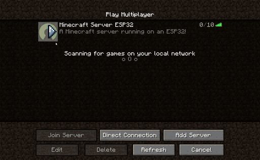
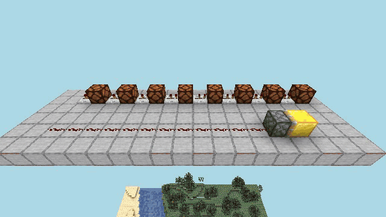

# esp32-minecraft-server

A Minecraft Java Edition server that runs on an ESP32. It speaks the 1.16.5
protocol (754), so an unmodified client can join. The world is generated on the
chip and stored in a compact, crash-safe binary format on the network through a
**Network Block Device** (NBD) or in one file on a **microSD card**, so it is not
limited by the board's flash.

This is a rewrite of [nikisalli/esp32-minecraft-server](https://github.com/nikisalli/esp32-minecraft-server).
The server core (`lib/mcore`) is portable C++17. The same code also builds as a PC
server, which runs the unit and end-to-end tests. The ESP-IDF 5.5 firmware runs in an
emulated ESP32-S3 or ESP32-P4 for debugging, benchmarking and load tests ([docs/EMULATOR.md](docs/EMULATOR.md)).
Migration checks and the stress-test regression fix are documented in
[docs/ESP_IDF_MIGRATION.md](docs/ESP_IDF_MIGRATION.md).



*The firmware on real hardware: a Waveshare ESP32-S3-Touch-AMOLED-1.8 (8 MB PSRAM) over
WiFi, played with the Minecraft 1.16.5 client. After some digging and building, the
player flies over freshly generated terrain with `/perfbar` on: TPS and tick times on
top, free heap, resident chunks, mobs and players below. Played back at 4× speed.*



*Redstone on the same board: a repeater chain lights eight lamps one after another and
a dust line drives a sticky piston, switched on and off every 2 s (real time). Recorded
with `test/record_redstone_gif.js --host <board ip>`; more recordings are planned in
[docs/GIFS.md](docs/GIFS.md).*

## Webflasher
You can try my experimental [webflasher](https://julianstremel.github.io/esp32-minecraft-server/)


## Features

- **Protocol 1.16.5**, offline mode:
  - server list with MOTD, player count and icon
  - zlib-compressed packets
  - vanilla registries and tags, keep-alive, tab list with ping
- **Terrain:** seeded generator with 25 biomes (oceans, rivers, beaches, deserts,
  badlands, jungles, taigas, mountains, ...), caves, ores and six tree types. A seed
  gives the same world on the ESP32 and the PC, block for block, with the same detail
  up to vanilla's world border (see [World generator](#world-generator)). Superflat
  and void worlds are also available. Chunks are streamed nearest-first within the
  view distance.
- **The Nether and the End:** both dimensions are generated and saved (see
  [Dimensions](#dimensions)). Nether portals are built as in vanilla: an obsidian
  frame lit with flint and steel, linked to a portal in the other dimension (built
  there when there is none). The End has its main island with vanilla's obsidian
  spikes and the **dragon fight** (end crystals, boss bar, the exit portal and the
  egg). Operators can also travel with `/dimension`, or place `end_portal` blocks.
- **Lighting:** sky light and block light. Near players (`exactLightDistance`, 2 chunks by
  default) a chunk's light is computed with its neighbours' blocks, so torches and
  overhangs light and shade across chunk borders exactly; farther chunks use faster
  per-chunk light (the [comparison](#compared-with-vanilla-1165) lists where it differs
  from vanilla).
- **Survival:**
  - digging with server-side timing and tool tiers, drops and item pickup
  - health, hunger, saturation, fall damage, drowning, lava and fire, death and respawn, XP
- **Items and containers:**
  - player inventory, the vanilla crafting recipes (2x2 and 3x3), chests, trapped chests, barrels
  - furnaces, smokers and blast furnaces that smelt with fuel
  - beds (respawn point), signs, doors, trapdoors, levers, buttons, buckets, bows, food
- **World simulation:**
  - flowing water and lava, falling sand and gravel
  - crops, sugar cane and cactus growth, grass spreading
  - correct shapes for stairs and fences, support checks (plants, torches, ...)
- **Redstone** (see [docs/REDSTONE.md](docs/REDSTONE.md) for coverage and limits):
  - dust, torches, repeaters, comparators, observers, lamps, levers, buttons, pressure
    plates, tripwire, daylight detectors, targets, note blocks, powered doors
  - pistons and sticky pistons (slime and honey blocks, the 12-block limit), primed
    TNT with its fuse and chain reactions
  - hoppers, droppers and dispensers moving items; books and lecterns
- **Mobs:**
  - passive: cows, pigs, sheep, chickens
  - hostile: zombies, skeletons (they shoot), spiders, creepers (they explode)
  - the Nether: zombified piglins (neutral until one is hit, then the group attacks),
    ghasts (fireballs you can hit back), magma cubes (they jump and split)
  - hostile mobs burn in daylight; mobs spawn by light level (caves by day, not near torches), take damage and drop loot; PvP
- **Commands:** `help list msg tell w me seed spawn tps lag storage` for everybody;
  `menu gamemode dimension dragon tp give clear time weather kill setworldspawn
  spawnpoint say difficulty xp heal feed summon setblock fill op deop kick save-all
  stop fly perfbar workers` for operators (`teleport` and `experience` are aliases).
  Tab completion works.
- **Operator menu:** `/menu` opens a window of buttons for statistics, settings,
  players, dimensions, the dragon fight and a world reset with a new seed (see
  [Operator menu](#operator-menu)).
- **Status dashboard (optional build flag):** a read-only web page served by the
  board itself, with TPS, memory, players and the world, pushed live once a second
  (see [Status dashboard](#status-dashboard)).
- **Persistence** on any NBD server or a microSD card: chunks you changed (in all
  three dimensions), player data (dimension, position, inventory, health, XP, spawn
  point), world metadata, the known nether portals and the dragon fight. Chunks that
  were never modified are not stored at all, because they are regenerated from the
  seed.
- **Two worker threads**, one per core, generate, light and compress chunks, so the
  game loop stays responsive (see [Threads](#threads)).

## Hardware

**A board with at least 8 MB of PSRAM is required.** Chunks, packet buffers and the
worker threads' buffers live in PSRAM, and the firmware refuses to start without it.

| chip / PSRAM | ESP-IDF board profile | network |
|---|---|---|
| ESP32-S3, 8 MB octal PSRAM | `esp32s3-8` (default) | WiFi |
| ESP32-S3, 16 MB octal PSRAM | `esp32s3-16` | WiFi |
| ESP32-P4, 8 MB PSRAM | `esp32p4-8` | RMII Ethernet / LAN8720 |
| ESP32-P4, 16 MB PSRAM | `esp32p4-16` | RMII Ethernet / LAN8720 |

All profiles require at least 8 MB flash. The suffix denotes PSRAM independently
of flash. WROVER and the classic ESP32 are no longer supported. The same four
profiles run in esp-emulator, see [docs/EMULATOR.md](docs/EMULATOR.md).

With 8 MB of PSRAM the ESP32-S3 build serves up to 10 players with a view
distance of up to 32 and keeps about 200 chunks resident.

## Quick start

1. **Start an NBD server** that holds the world, on any machine in your network
   (a PC, NAS or Raspberry Pi):

   ```sh
   # the bundled server (Python 3, no dependencies); the image is created sparse
   python3 tools/nbd_server.py --file world.img --size 2G --port 10809

   # or any standard NBD server
   nbdkit -f file world.img                      # truncate -s 2G world.img first
   qemu-nbd -t -f raw -p 10809 world.img
   nbd-server 10809 /path/to/world.img
   ```

   The world border is `MC_WORLD_RADIUS` chunks from the centre (64 by default, up to
   vanilla's 1874999 = 29 999 984 blocks); it does not depend on the size of the
   export. Space is taken when a chunk is first saved (128 KiB of address space per
   saved chunk, of which the record uses a few KB), so the export only has to hold the
   chunks players changed: 2 GiB is about 16 000 of them. A full export stops saving
   (with a warning in the log and in `/storage`) without losing anything already
   saved; grow it by restarting the NBD server with a larger `--size`. The image is
   sparse (also on Windows/NTFS), so it only uses as much disk as the world needs.

2. **Configure:** copy `include/config_edit_me.h` to `include/config.h` and set your
   WiFi credentials, `NBD_HOST` (the machine from step 1) and the server options
   (MOTD, game mode, difficulty, operators, whitelist, seed, world type, ...).

3. **Build and flash** with [ESP-IDF v5.5.5](https://github.com/espressif/esp-idf/tree/v5.5.5)
   (source its `export.sh` first). Use `--board` to select the profile above.
   P4 Ethernet wiring and clock/PHY settings are configurable via `menuconfig`.
   Each profile has its own sdkconfig and build directory:

   ```sh
   tools/idf/build.sh --board esp32s3-8 build
   tools/idf/build.sh --board esp32s3-8 -p /dev/ttyUSB0 flash monitor
   tools/idf/build.sh --board esp32s3-8 --dashboard build    # with the status dashboard
   ```

4. **Connect** with Minecraft 1.16.5 to the IP address printed on the serial
   console, or to `esp32-minecraft.local` (mDNS). Lines typed into the serial monitor
   run as server console commands (operator commands included), e.g. `perfbar on`.

Without `NBD_HOST` the server still runs, but the world resets on every reboot.
Instead of NBD, the world can live on a microSD card in the board (`SD_CARD 1`, see
[World on a microSD card](#world-on-a-microsd-card)).

### Web flasher

[julianstremel.github.io/esp32-minecraft-server](https://julianstremel.github.io/esp32-minecraft-server/)
flashes the `esp32s3-8` firmware (bootloader at 0x0, partition table at 0x8000, app
at 0x10000) from desktop Chrome or Edge with [ESP Web Tools](https://esphome.github.io/esp-web-tools/).
The page lives in [`web/`](web/); `.github/workflows/pages.yml` builds the firmware in
the `espressif/idf:v5.5.5` image on every push to `main` (or manually) and deploys
the page plus the binaries. Enable it once under *Settings → Pages → Source: GitHub
Actions*.

CI writes its own `include/config.h` on top of `config_edit_me.h` with the placeholder
SSID `unconfigured`, an empty password, no `NBD_HOST` and no operators, so the
published firmware contains nobody's credentials. After flashing from the web, ESP Web
Tools provisions WiFi over [Improv Serial](https://www.improv-wifi.com/serial/) and
stores the entered credentials in NVS (`wifi` namespace). On next boot, firmware loads
those credentials before trying to connect, and keeps them across normal app updates.

The app is flashed without touching the NVS partition (0x9000), so stored
credentials survive web updates unless *Erase device* is chosen.

## World generator

Chunks nobody changed are not stored but generated again from the seed whenever they
are needed, so the generator must always produce exactly the same blocks: on the
ESP32 and on the PC, in whatever order and on whatever thread chunks are generated.

- Floating-point code is compiled without fused multiply-add
  (`-ffp-contract=off`). The ESP32's FPU has one and x86-64 does not; the old firmware
  fused 46 multiply-adds in the generator and noise code, each rounding differently
  from the PC build. Worlds the old firmware created change once: in about 0.6% of
  their unmodified chunks, 1 to 3 blocks come out differently (a surface column one
  block higher or lower, a cave air block more or less). Worlds of the PC build are
  unchanged.
- Every world stores the version of the generator that created it, and keeps it.
  **Version 2** (new worlds) computes noise coordinates from the integer block
  coordinates with integer arithmetic (frequencies are exact fractions) and hashes the
  noise gradients instead of using a 256-entry table. The terrain has the same detail
  at 29.9 million blocks as at spawn and never repeats. Each noise octave is shifted by
  its own seed-derived fraction of a cell, so the lattice nodes of different octaves
  and layers (where gradient noise is 0) never line up; otherwise every world had a
  river through (0, 0) and a mountain peak every 2000 blocks. **Version 1**, the
  original generator, stays for worlds created with it; its float coordinates lose
  detail far out and repeat every 256 noise cells, and it has those aligned nodes.
- A world needing a generator version that this build does not have is not opened,
  and `--generator` accepts only versions it has. Worlds of version 2 or later are
  stored with storage format 2: firmware from before generator versions existed reads
  only format 1, so it refuses these worlds instead of regenerating them with
  version 1.
- Two fingerprints per version and seed cover nine chunks (at spawn, 1 million and
  29.9 million blocks out): one over their blocks, one over the bit patterns of the
  noise values and unrounded heights behind them. The second catches any rounding
  difference at once; the blocks of nine chunks would mostly not show one (a build
  with fused multiply-add still matched 5 of 6 block fingerprints). A probe also
  checks that the generator was compiled without fused multiply-add. The unit tests
  and the device benchmark (`tools/emulator/run.sh --bench`, which fails on a mismatch)
  compare each selected emulated chip with the values the PC build computed.
- Run `tools/emulator/run.sh --board esp32s3-8 --bench` (or a P4 profile) to
  compare the current device build with the reference fingerprints. Timing from
  the former QEMU runner is not comparable to esp-emulator.

## Operator menu

`/menu` (operators) opens a chest window whose items are buttons, with their values in
the tooltips (`lib/mcore/src/mc/server/menu.cpp`):

- **Statistics**: TPS, tick times, memory, chunks, workers, storage, players, mobs,
  uptime (click to refresh).
- **Settings**: difficulty, mob spawning, PvP, the performance banner, day and night,
  the weather.
- **Players**: everyone online; per player teleport there or here, game mode, heal and
  feed, operator on/off, kick.
- **World**: go to a dimension, set the world spawn, the dragon fight (respawn or reset
  it), and **a new world**: type a seed in the chat (a number, or any text, which
  becomes Java's hash of it as in vanilla) or pick a random one, choose the world type
  (normal, flat, void), then *Reset the world* and confirm. Everyone is disconnected,
  the storage formats a new world with that seed (chunks, players, portals and the
  dragon fight are gone), and the server restarts (the board reboots, the PC server
  starts itself again); the new world's spawn is found on start.

The actions run the same code as the commands. With the 1.21.8 protocol the menu would
become a dialog form (see [docs/MIGRATION_1_21_8.md](docs/MIGRATION_1_21_8.md)). Test:
`test/op_menu.js` (`--reset` deletes the world it runs on: on the board it was run
against a scratch NBD image).

## Status dashboard

A read-only status page in the browser, served by the board: build with
`tools/idf/build.sh --dashboard` (or `idf.py -D MC_DASHBOARD=ON`) and open
`http://<board ip>/` or `http://esp32-minecraft.local/`. Without the flag the firmware
has neither its code nor its page. The port is `MC_DASHBOARD_PORT` in `config.h`
(default 80, 0 turns it off); the PC server has it with `--dashboard PORT`.

It shows TPS and tick time (with a graph of the last 3 minutes), free memory, chunks
and entities, the world (seed, time, weather, spawn, portals, the dragon fight), the
players online (dimension, position, health, food, level, game mode, ping), chunk work
and storage, and the slowest loop pass.

**The board pushes it:** the page subscribes to `GET /api/events` (Server-Sent Events)
and gets the state as JSON once a second. The game loop only copies values into a
snapshot, preferably in a pass with at least 5 ms left before the next tick; a worker
job at background priority turns the snapshot into JSON, and the job's `finish()`
hands the event to every open page. Nothing is snapshotted while no page is open, and
a page closes its stream while its tab is hidden. `GET /api/status` returns the same
JSON once (for scripts, and for a page whose stream was refused: it then polls every
2 s).

How it is built (`lib/mcore/src/mc/server/dashboard.cpp`):

- **No task of its own:** the listening socket and up to 4 connections (at most 3 of
  them event streams) are polled on the game loop with the players' sockets; other
  requests get one answer and `Connection: close`. A connection that has sent nothing
  for 250 ms gives its place to a newcomer (browsers open spare connections ahead of
  time). A stream that is still sending the last event skips the next one.
- **Memory:** 7 KB of PSRAM per open connection plus 7.5 KB for the event in the
  making, nothing while no page is open; no measurable internal RAM (106 KB free,
  lowest 39 KB, with and without it in the same session).
- **The page** (`tools/dashboard/index.html`, 8.5 KB) is gzipped into flash
  (3.9 KB; `node tools/gen_dashboard.js` regenerates `dashboard_page.h`) and sent with
  an ETag, so a reload costs a 304. The firmware grows by 15 KB.
- **Cost on the ESP32-S3** (`test/dashboard.js` reports it; the `dashboard` part of
  the JSON has the figures):

  | | game loop | worker |
  |---|---|---|
  | pushed event, no player online | 0.2 ms snapshot once a second | 1.1 ms JSON |
  | pushed event, a player loading terrain | 0.4 ms snapshot | 1.4 ms JSON |
  | `/api/status` request (JSON built on the loop) | 1.2 to 1.5 ms | |

  printf is what costs: 50 to 130 µs a call on this chip, so the snapshot has none (the
  chunks' memory, about 7 µs a chunk, is counted over 32 snapshots). In a 70 s session
  with a player loading terrain and a page open, TPS stayed at 20.0, 2.9 ms/tick and
  the longest loop pass 6 ms, as without the dashboard; polling `/api/status` 10 times
  a second instead made that 9 ms. While the workers are busy with chunks an event can
  come up to 3 s late (median gap 1.0 to 1.1 s).

There is no login: anyone on the network can read it (player names and positions
included). Test: `test/dashboard.js`.

## Dimensions

The overworld, the Nether and the End share one chunk cache: chunks are keyed by
(dimension, x, z), and every player and entity has a dimension that view streaming,
entity tracking, `broadcastNear`, chunk pinning and the background jobs filter by.
Each dimension has its own generator and its own storage regions (the region key
includes the dimension), and player records keep the dimension (version 2; version 1
records load into the overworld).

- **Nether:** a 3D density field on a 4 x 8 x 4 block lattice, interpolated, biased to
  solid at the floor and the ceiling; a lava sea up to y = 31, bedrock at y = 0 and a
  ragged bedrock ceiling at y = 127 (nothing above it). Soul sand and gravel near the
  sea, quartz and Nether gold veins, magma blocks, glowstone hanging from ceilings.
  One biome (`nether_wastes`). Water poured in the Nether evaporates; lava flows as
  far as water and three times as fast.
- **End:** the main end stone island around (0, 0), its rim wobbled by noise, void
  everywhere else, and vanilla's 10 obsidian spikes on a ring of radius 42 (76 to 103
  high, the second and third lowest caged in iron bars; their order comes from
  `java.util.Random` reproduced, so a seed's spikes are vanilla's). Arrivals land on
  vanilla's 5 x 5 obsidian platform at (100, 48, 0), rebuilt on every arrival. No
  outer islands yet.
- **The dragon fight** (`lib/mcore/src/mc/server/dragon.cpp`, after vanilla's
  EndDragonFight and EnderDragon in a simpler form): when a player comes within 192
  blocks of the island's centre, the exit portal's bedrock bowl is placed, an end
  crystal stands on every spike and the dragon appears, with its boss bar. It flies
  vanilla's flight model between vanilla's path nodes (rings of radius 60 and 40),
  strafes players with fireballs that leave a cloud of dragon's breath (6 damage a
  second), charges them, and perches on the exit portal to breathe at them; its head
  and neck hurt, its wings throw players aside. The nearest crystal within 32 blocks
  heals it by 1 every 10 ticks; a destroyed crystal explodes (power 6, chains to the
  next), and the one healing the dragon costs it 10 health. Hits on its head do full
  damage, elsewhere a quarter plus 1, arrows bounce off while it perches; as in
  vanilla, the client's part ids are one off, so the neck's hitbox hits the head and
  the head's does nothing. Dead, it rises and spins for 10 s, then the exit portal
  opens, the first kill leaves the dragon egg on it and the players nearby share
  12000 XP (500 later). The fight's state (health, crystals left, portal, killed
  before) is saved with the world; the dragon and crystals come back after a restart
  while it is not over. `/dragon status`, `/dragon respawn` (a new fight) and
  `/dragon reset` (as never fought) are for operators. Not yet: end gateways, outer
  islands, the credits, respawning the dragon with four crystals.
- Neither has sky light: the light engine skips its sky pass and light packets carry
  none. Beds explode there (as in vanilla, but with today's simple explosions).
  Natural spawning in the Nether: zombified piglins, ghasts and magma cubes (see
  below); in the End not yet.
- **Nether mobs** (`lib/mcore/src/mc/server/nether_mobs.cpp`, after vanilla):
  zombified piglins carry a golden sword and leave players alone until one of them is
  hit; then every zombified piglin within 35 blocks (10 up or down) attacks that player
  for 20 to 39 seconds. Ghasts float to random places within 16 blocks, target a player
  within 64 blocks and 4 up or down, and while they can see the player charge for one
  second and shoot a fireball; a fireball accelerates towards its target, explodes
  (power 1, setting fire) where it hits, and a player who hits it sends it where they
  look: sent back into its ghast it kills it. Magma cubes (sizes 1, 2 and 4: health 1,
  4, 16) jump at players every few seconds, hurt them on contact (size + 2) and split
  into 2 to 4 cubes of half their size when killed. All three are immune to fire and
  lava. Spawning (vanilla's nether_wastes list): zombified piglins (weight 100, packs of
  4), ghasts (50, alone, 1 attempt in 20) and magma cubes (2), light does not matter.
  `/kill @e[type=<entity>]` (or `type=!player`) removes entities in the sender's
  dimension. Tests: `host/tests/test_nether_mobs.cpp`, `test/nether_mobs.js` (a ghast
  killed with its own fireball, a magma cube, a piglin group, natural spawning) and
  `test/mob_load.js` (what mobs cost per tick).
- **Nether portals** (`lib/mcore/src/mc/server/portals.cpp`): flint and steel used
  inside an obsidian frame (inside 2 x 3 up to 21 x 21, along x or z; the corners may
  be missing) fills it with portal blocks. A portal breaks as a whole when a block next
  to it in its plane becomes anything but portal or obsidian. Standing in one takes
  80 ticks in survival, 1 in creative. The traveller arrives at the nearest known
  portal within 128 blocks (16 in the Nether) of the position x 8 (or / 8); without
  one, a 4 x 5 frame is built at the nearest place with room within 16 blocks (in the
  Nether between its lava sea and its ceiling), or on an obsidian floor at the target
  when there is no room. Known portals (lit or built, up to 96) are saved with the
  world in a small record next to the superblock, so links survive restarts; a portal
  broken since is forgotten when it is next looked for.
- **Travel by command:** `/dimension <overworld|the_nether|the_end> [player]`. Going
  to the Nether lands at the overworld position / 8 in the nearest cave with room to
  stand within 8 blocks, or on a new 3 x 3 obsidian platform; going back lands at x 8
  on the surface. An `end_portal` block takes a player to the End, and in the End back
  to their spawn. After arriving, portals do nothing for 300 ticks (while the player
  still stands in one, the time starts again). The destination's
  chunks are loaded or generated on the workers first, so travel does not stall the
  game loop (the slowest loop step was 83 to 103 ms when travelling into new Nether
  chunks on the board, now 13 to 20 ms, the same as without travel).
- A `Respawn` packet carries the new dimension; the server then resends the view,
  entities, inventory, health, XP and time. Join Game lists all three worlds.
- The Nether and End generators have their own golden fingerprints
  (`GENERATOR_DIM_GOLDEN`), checked by the unit tests and the device benchmark.
- Tests: `host/tests/test_dimensions.cpp`; on a board or the PC server,
  `test/hardware_dimensions.js` (travel by command and by portals, Nether terrain,
  building, entity tracking across dimensions, the dimension surviving a reconnect or
  restart), `test/nether_portal.js` (a frame lit with flint and steel, 4 s in it to
  the Nether where a linked portal is built, back through it to the first, the
  portal breaking with its frame), `host/tests/test_portals.cpp` and
  `test/travel_stall.js` (the game loop's slowest step during travel).

## World on a microSD card

Instead of NBD, the world can live on a microSD card in the board (`SD_CARD 1` in
`include/config.h`; `src/sd_storage.cpp`):

- The card stays an ordinary **FAT32** card. The world is one file on it
  (`SD_WORLD_FILE`, default `world.img`), created the first time, **contiguous**
  (preallocated with FatFs' `f_expand`), so writing to it never touches the FAT or the
  directory; copy it to a PC for a backup, or open it there with
  `mcserver --file world.img`.
- **exFAT does not work**: ESP-IDF 5.5 builds FatFs without it (`FF_FS_EXFAT 0` in its
  `ffconf.h`, no menuconfig option). Cards over 32 GB come formatted exFAT and need
  reformatting as FAT32. A FAT32 file is at most 4 GB: the world file is 2048 MB by
  default (`SD_WORLD_SIZE_MB`; each saved chunk takes 128 KB, so ~16 000 chunks), up to
  4095 MB. The firmware never formats a card unless `SD_FORMAT_IF_NEEDED` is set.
- The file is read and written through FatFs directly (32-bit offsets, the full 4 GB;
  ESP-IDF's file layer would stop at 2 GB), through a 4 KiB DMA-capable buffer in
  internal RAM so the SD driver moves 8 sectors per command (with PSRAM buffers it falls
  back to one sector per command).
- **A write-back cache** (`lib/mcore/src/mc/storage/write_cache.cpp`, 32 lines of
  16 KiB in PSRAM, `SD_CACHE_LINES` / `SD_CACHE_LINE_KB`) turns the store's small writes
  (region maps, superblocks, player records, log entries) into aligned 16 KiB writes;
  neighbouring lines go out as one write. It writes lines in the order they were first
  changed, on every flush (each save) or when it needs room, so a power cut loses at
  most what was not saved yet; the store keeps two copies of every record. In the unit
  test's save pattern (120 chunks, players, metadata, three saves) the card sees 105
  writes and none under 4 KiB, instead of 187 writes of which 107 are under 4 KiB (in
  exchange for more bytes: 1.7 MB instead of 0.3 MB, a 3 KB record becoming a 16 KiB
  line).
- **Pins**: the Waveshare ESP32-S3-Touch-AMOLED-1.8 has its TF slot on **1-bit SDMMC**:
  CLK GPIO2, CMD GPIO1, D0 GPIO3 (Waveshare's BSP `esp32_s3_touch_amoled_1_8`). The card's
  D3 / CS line is on the TCA9554 I/O expander (EXIO7); like the BSP, the firmware leaves
  it alone. For SPI mode the same lines are MOSI (GPIO1), SCK (GPIO2) and MISO (GPIO3),
  with CS through the expander, which the firmware does not drive (`SD_PIN_CS -1`). The
  board's other buses, for reference: I2C (touch, expander, PMU, codec, RTC, IMU) SDA
  GPIO15 / SCL GPIO14, the AMOLED's QSPI CS GPIO12, PCLK GPIO11, DATA0-3 GPIO4-7, touch
  interrupt GPIO21, audio I2S GPIO8/9/10/16/45. Other boards: `SD_PIN_*` (4-bit SDMMC with
  D1-D3) or `SD_MODE_SPI` with a CS pin.
- Status: built and unit-tested (the cache, the world store through it); on the board
  the SDMMC driver came up and timed out waiting for a card (none was inserted), so the
  card path itself is not tested on hardware yet.

## Storage format

The world lives on the NBD export as raw binary records. NBD transfers fixed-size
binary blocks with almost no protocol overhead, and every NBD server can serve a
plain file:

```
0       superblock copy A  \  alternate writes with a sequence number;
512     superblock copy B  /  the newest valid copy wins
1024    world state        portals and the dragon fight, two copies with a CRC
4096    player table       hashed by UUID, 1024 bytes per entry
...     region directory   append-only log: where each 32 x 32-chunk region's slot
                           map is, and the allocation watermark (CRC per entry)
...     data area          128 KiB units: a chunk's two slots, or a region's slot map
                           (two copies, sequence number and CRC); a unit is handed out
                           when a chunk is first saved, never freed
```

- This is format 4: item metadata (NBT) in chunk inventories and variable-size player
  records. Each player table entry has two independent descriptors; a save writes and
  flushes the older payload before publishing its descriptor.
- **Worlds are not converted.** A world in an older format (1 and 2 had a dense chunk
  area that capped the world at the export size, 3 had no item metadata) is
  discarded when this build opens it: the log says so and a new world starts in its
  place, on NBD as on an SD card. Keep a copy of the export if you want the old world.
- The directory is replayed into RAM when the world opens (16 bytes per region); up
  to 40 slot maps are cached. A chunk in a region without a map, or with an empty map
  entry, was never saved: it is generated without reading the export. A batch of
  loads costs one round trip for the missing maps, then the usual two.
- Writes go record, map, directory, so a power cut leaves the old copy or nothing.
  Units are only used below a watermark that is logged and flushed first, so a unit
  is never handed out twice (after a restart allocation continues above it).

- A chunk save goes to the older of its two slots, with a CRC32 and zlib
  compression. An interrupted write, for example from a power cut, never destroys
  the last good copy.
- A chunk record also holds the chunk's pending scheduled block ticks (flowing
  water and lava, buttons, fire) with their delays and priorities, like vanilla's
  `TileTicks`, so they continue after a restart. Records written before this
  (without the ticks flag) still load.
- Reads are pipelined: the storage lookups of all chunks the players need in a
  tick share one round trip. Writes are posted, so their replies are collected
  later. A dedicated storage thread owns the connection and reconnects after errors;
  saved chunks stay pinned until their writes and flush are acknowledged.
- The world autosaves every 60 s and saves on `/stop`.

## Threads

```
core 1:  server task (game loop, 20 TPS)  |  worker 1 (lower priority: runs while the loop sleeps)
core 0:  WiFi / lwIP  |  storage I/O task  |  worker 0
```

The game loop sleeps until there is something to do. It waits in `select()` on the
listening socket, the players' sockets (and, for sockets with unsent output, on
room to write) and an `eventfd`. A periodic 50 ms `esp_timer` notifies the game task
once per tick and signals the `eventfd`; a worker signals it when it finishes urgent
work. The storage thread signals it when a result is ready. The PC build does the same with `poll()` and a pipe
(`plat::waitForWork()`). If the timer fired more than once since the loop last
looked, the loop overran a tick: late ticks are caught up, up to five at a time, and
more than a second behind, the backlog is dropped with vanilla's "Can't keep up!"
warning. `/tps` shows the wakeups per second and the overruns, late and skipped
ticks of the last 2 s; `/lag` also shows why the waits ended.

The game loop handles packets and game logic. A bounded FIFO on the storage
thread handles chunk reads/writes, player records, metadata and reconnects; its
completions are applied on the game loop. See the [storage I/O report](docs/STORAGE_IO.md)
for before/after measurements and the remaining synchronous compatibility calls.
Everything CPU-heavy
runs on the workers ([`lib/mcore/src/mc/jobs.h`](lib/mcore/src/mc/jobs.h),
[`server/chunk_jobs.h`](lib/mcore/src/mc/server/chunk_jobs.h)):

- generating chunks and decoding stored ones
- computing light and building and compressing the chunk and light packets
- re-lighting after block changes
- encoding and compressing chunk saves
- formatting the status dashboard's JSON (builds with `MC_DASHBOARD`)

Jobs work on snapshots (a copy of the chunk plus its neighbours' border heights),
never on the live world. Their results are applied by the game loop. A chunk with
a job in flight is not evicted, and a packet prepared from a chunk that changed in
the meantime is rebuilt.

The queue has four priority classes, each with a waiting budget: urgent (0 ms),
high (100 ms), normal (500 ms) and background (3 s). A job's deadline is the time it
was queued plus its budget, and the workers always take the job with the earliest
deadline. Urgent work therefore goes first, but a waiting background job's deadline
eventually comes before that of every newly queued urgent job, so a steady stream of
urgent work cannot starve it.

- urgent: the chunks under and next to a player (distance ≤ 1)
- high: chunks within 3 chunks, and re-lighting after block changes
- normal: the rest of the view distance
- background: saves

Loads and sends are promoted when a player comes closer and cancelled when every
player has moved out of range. Loads go through an admission step: a few slots are
reserved for urgent loads, and every player gets a share, so one fast player
cannot take every slot. `/workers` shows the queue per class and the longest wait.

On the ESP32-S3 board (device benchmark, `test/hardware_bench.js`; the history is in
[docs/measurements](docs/measurements/README.md)): a new chunk costs about 48 ms of one
core: generation 29 ms, per-chunk light 7 ms, compression 9 ms. Exact light across
chunk borders costs 38–140 ms per chunk depending on the terrain, so only one such job
runs at a time.

Historical measurements on the previous QEMU build (not esp-emulator results):

- A new chunk costs about 52 ms of CPU time: generation 34 ms, light 8.5 ms,
  compression 8 ms. That is more than a whole 50 ms tick of one core.
- With players exploring new terrain, the two workers cut the longest game-loop
  stalls from 250–400 ms to roughly 25–90 ms and deliver about 1.5–2× as many
  chunks per second.
- With the priority queue instead of a single FIFO queue (6 players, 2 workers,
  3 runs each), the chunk under a player who jumps into new terrain arrives after
  about 680 ms instead of 1020 ms, all nine chunks around them after about 1.2 s
  instead of 4.3 s, and the throughput is about 10% higher (22 vs. 20 chunks/s).
- With the event-driven loop instead of polling every millisecond (6 players,
  2 workers, 3 runs of 2 phases each), the game loop wakes up about 35 instead of
  about 540 times a second. The worker on the game loop's core gets the time it no
  longer spends polling: about 15% more chunks per second (25 vs. 22 on average;
  the runs vary by about as much), with the same 20 TPS. The longest stalls are
  still the storage reads in that historical build. The current storage-thread
  measurements are in [STORAGE_IO.md](docs/STORAGE_IO.md).

`/workers N` changes the CPU pool size at runtime (0 runs CPU jobs on the game loop;
the storage thread remains active).
`/lag` shows what the slowest recent loop iteration spent its time on.
`/perfbar [on|off]` shows a live banner (two stacked boss bars) to every player: TPS, tick time,
longest stall, free heap, resident chunks, mobs and players, refreshed every second.

### Scheduled ticks

Everything that should happen at a later tick goes into one hierarchical timing wheel
([`lib/mcore/src/mc/timer_wheel.h`](lib/mcore/src/mc/timer_wheel.h)) keyed by the
world age: scheduled block ticks (fluids, buttons, fire), furnaces and mob timers
(creeper fuses, despawning items, dead mobs, fleeing and wandering). Scheduling and
cancelling cost O(1), each tick only takes its own bucket, and events far in the
future sit in coarser levels until they come close. Within a tick, events run by
priority and then in the order they were scheduled, like vanilla's scheduled ticks,
and a block can only have one pending tick (an O(1) check).

Furnaces are not ticked at all: their state is brought up to date when someone looks
or clicks, and the wheel wakes them for the next item or when the fuel runs out. So
idle and busy furnaces cost nothing between those events, and there is no limit on
how many can burn at once. Hunger, regeneration and other per-player state stay in
the player tick.

## PC build and tests

```sh
make -C host test                         # unit tests (227; DASHBOARD=0 leaves out the dashboard and its 6)
make -C host server                       # PC server: host/build/mcserver --help
host/build/mcserver --nbd 127.0.0.1:10809 # the same server, e.g. against tools/nbd_server.py
make -C host SAN=1 test                   # AddressSanitizer + UndefinedBehaviorSanitizer
make -C host TSAN=1 test                  # ThreadSanitizer (workers vs. game loop)

cd test && npm ci --ignore-scripts                    # end-to-end tests with mineflayer bots
node run_all.js                           # smoke, gameplay, persistence, mobs and load
NBD_IMPL=nbdkit node persistence.js       # persistence against nbdkit (or qemu-nbd)
node emulator_load.js --board esp32s3-8                         # load test of the firmware in esp-emulator
node hardware_smoke.js --host <board ip> --serial <port>        # the flashed firmware on a real board (Tester must be an operator)
node hardware_stress.js --host <board ip> [--flyers 8]          # 8 spectators fly apart through fresh terrain (MC_MAX_ONLINE >= 9)
node perf_suite.js --host <board ip> --label <name> --serial <port>   # 3 runs per scenario; compare with tools/perf_compare.js
node record_redstone_gif.js --host <ip>   # the redstone GIF above, from a board (see docs/GIFS.md)
```

Feature tests, each with `--host <board ip>` or `--local` (`SERVER_BIN=.../mcserver`):

```sh
node hardware_dimensions.js   # travel by command and portal blocks, Nether terrain, the dimension kept
node nether_portal.js         # a frame lit with flint and steel, linked portals, the frame broken
node nether_mobs.js           # ghast fireball sent back, magma cube, piglin group anger, Nether spawning
node dragon_fight.js          # crystals, part hits, death, exit portal, egg, XP; /dragon reset
node op_menu.js [--reset]     # the operator menu; --reset deletes the world it runs on
node dashboard.js             # the status page, pushed events and JSON, errors, limits, what it costs the loop
node water_fall.js            # no fall damage after leaving water
node path_border.js           # mobs chasing across chunk borders and single-block steps
node item_float.js            # items bobbing in water at vanilla's pace
node mob_load.js / end_load.js / travel_stall.js   # (--host) what mobs, the dragon fight and travel cost per tick
```

`tools/gen_data.js` regenerates the registries (`lib/mcore/src/mc/data/`) from
minecraft-data. `tools/fetch_vanilla.sh` downloads the vanilla server jar and
extracts the data-pack tags that `gen_data.js` turns into the Tags packet.

## Compared with vanilla 1.16.5

✅ like vanilla · 🟡 partly or simplified · ❌ missing. [docs/ROADMAP.md](docs/ROADMAP.md)
describes what the bigger gaps (Redstone, the Nether, ...) would take.

**Protocol and server**

| | | |
|---|---|---|
| Clients | ✅ | 1.16.4 / 1.16.5 (protocol 754); server list with MOTD, player count and icon; compression |
| Authentication | ❌ | offline mode only: no Mojang login, encryption or skins. Names are not verified, so the whitelist and the operator list only keep out people who do not know a listed name: run the server on a trusted network |
| Players, view | 🟡 | up to 10 players (S3 and P4 profiles); view distance up to 32 chunks like vanilla (far chunks are streamed, not kept in memory; a full view of 32 takes about 4 minutes to generate on an S3); the 3 chunks around each player stay loaded and crops grow only there, fluids flow in any chunk still in memory |
| World size | 🟡 | world border 64 chunks (1024 blocks) from the centre by default (`MC_WORLD_RADIUS`), up to vanilla's 29 999 984 blocks; the NBD export or the SD card's world file only holds the chunks players changed (2 GiB: about 16 000; a FAT32 file at most 4 GB); height 0-255 as in 1.16.5 |
| Settings | 🟡 | set at build time in `include/config.h` (the PC server takes command-line options); no `server.properties` |
| Administration | 🟡 | operators and whitelist from the config; `/op` and `/deop` change an online player until they reconnect (not saved); `/kick`, `/save-all`, `/stop`; `/menu` (statistics, settings, players, a world reset with a new seed, which restarts the server); a read-only web dashboard (build flag); no `/whitelist`, bans, spawn protection, gamerules, RCON, query or resource packs |
| Movement checks | 🟡 | digging time, reach and a teleport back after huge jumps; no flying, noclip or speed checks, so a modified client can fly in survival |
| Chat | ✅ | chat, `/msg`, `/me`, `/say`, join, leave and death messages (simplified), vanilla's spam limit; no `/tellraw` |
| Mods | ❌ | no data packs or plugins |

**World generation**

| | | |
|---|---|---|
| Terrain | 🟡 | its own seeded generator: a seed gives the same world on the ESP32 and the PC, but not the world vanilla generates for that seed |
| Biomes | 🟡 | 25 of the 68 overworld biomes |
| Caves, ores, plants | 🟡 | noise caves and caverns, ores, six tree types (small forms only: no 2x2 dark oak, jungle or spruce trees, no large oaks), grass, ferns, flowers, cactus, sugar cane, pumpkins, snow and ice; no ravines, lakes, springs, dungeons, mushrooms, kelp, seagrass, coral, vines, bamboo, ... |
| Structures | ❌ | no villages, mineshafts, strongholds, temples, monuments, ... |
| Dimensions | 🟡 | the Nether (one biome, no structures; zombified piglins, ghasts and magma cubes) and the End (the main island with its spikes and the dragon fight; no outer islands, gateways or endermen); nether portals lit in obsidian frames and linked (no portal POI search beyond the saved list, no portal sounds or nausea overlay); travel by command too |
| Vanilla worlds | ❌ | cannot import or export Anvil (region file) worlds |

**Blocks and world simulation**

| | | |
|---|---|---|
| Placing and breaking | 🟡 | block states and shapes (stairs, fences, walls, chests, ...), survival digging times, tool tiers, drops; doors always get the same hinge (no double doors); fences and panes do not connect to glass and some other full blocks |
| Lighting | 🟡 | sky and block light, exact across chunk borders within `exactLightDistance` (2 chunks) of a player, including updates when a block near a border changes; farther away block light stops at chunk borders and sky light crosses them only from the neighbours' open-sky columns. Emission now uses the official 1.16.5 block-state values, including lit/unlit transitions. Some opaque blocks (furnaces, barrels, pumpkins, melons, TNT, glowstone, ...) let light through, and slabs and stairs do not shade |
| Fluids | 🟡 | water and lava flow, sources, lava + water makes obsidian or cobblestone; simplified |
| Gravity | 🟡 | sand, gravel, concrete powder and anvils fall; concrete powder never hardens in water, falling anvils do no damage |
| Growth | 🟡 | wheat, carrots, potatoes, beetroots, sugar cane, cactus and grass grow, saplings grow into simple trees; growth ignores light and water, and farmland never dries; melon and pumpkin stems, sweet berries, cocoa, bamboo, kelp and vines never grow; no leaf decay, fire spread, or snow and ice in cold weather |
| Redstone | 🟡 | event-driven circuits, timing components, input sensors, note blocks, piston movement, TNT priming, hoppers/dropper transfers and initial dispenser actions. Full Java 1.16 timing/update-order parity and the remaining components are still in progress. See the [implementation plan, coverage and limits](docs/REDSTONE.md) |
| TNT, explosions | 🟡 | lit TNT is primed with vanilla's 80-tick fuse (by flint and steel, fire charges or redstone) and TNT caught in an explosion is primed with a shorter fuse (chain reactions); explosions (TNT, creepers, ghast fireballs, end crystals, beds outside the overworld) damage players, mobs and terrain and ignore blast resistance: only bedrock, obsidian and fluids survive; only ghast fireballs set fire; end crystals explode in chains |
| Block entities | 🟡 | chests, barrels, furnaces, smokers and blast furnaces, signs, hoppers, droppers, dispensers, moving pistons, daylight detectors and lecterns; brewing stands, enchanting tables, beacons, shulker boxes, banners and spawners remain open |

**Items**

| | | |
|---|---|---|
| Crafting | 🟡 | the vanilla crafting recipes in 2x2 and 3x3 grids, but each slot takes one exact item (no mixing plank or wood types); no special recipes (dyeing, fireworks, banners, copying maps and books, repairing tools in the grid); no recipe book |
| Smelting | 🟡 | 34 recipes plus logs and wood to charcoal (no glazed terracotta, cracked bricks or nuggets); about half the vanilla fuels (no stairs, doors, signs, ladders, bows, ...); smokers and blast furnaces smelt everything twice as fast; no XP from smelting |
| Item data (NBT) | 🟡 | metadata survives network slots, transfers, chunk saves and player saves; book editing/signing and lecterns work. Preserving tags does not implement every enchantment, potion, banner or firework effect |
| Workstations | 🟡 | crafting table, furnace, smoker, blast furnace; no enchanting table, anvil, grindstone, smithing table, brewing stand, stonecutter, loom, cartography table |
| Tools and gear | 🟡 | tools, armour, durability, bows, buckets, food, shears, hoes, bone meal, flint and steel; no crossbow, trident, shield, elytra, totem, fishing rod, potions, ender pearls, snowballs, eggs |

**Entities**

| | | |
|---|---|---|
| Mobs | 🟡 | 12 of the 70 mob types behave like vanilla's: cows, pigs, sheep (shearing), chickens, zombies, skeletons, spiders, creepers; in the Nether zombified piglins, ghasts and magma cubes; the ender dragon (simplified phases). Spawn eggs and `/summon` create the others too, but they only wander (no attacks, no loot). Hostile mobs burn in daylight. Chasing zombies, spiders, creepers and zombified piglins find their way around walls and gaps with A* path finding on the worker threads (avoiding lava, fire, cactus and drops over 3 blocks); wandering mobs and skeletons still walk straight |
| Spawning | 🟡 | by light level as in vanilla: hostile mobs where sky light ≤ random(32) and the light (sky darkened by time of day and weather) ≤ random(8), so caves spawn mobs by day and torches stop them; animals on grass in light above 8, every 400 ticks; vanilla's packs (3 of up to 4) within 8 chunks of a player, 24 to 128 blocks away. Simplified: packs stay in their chunk, a fixed number of attempts per tick instead of one per chunk, no biome spawn lists or mob sizes; caps scaled to 24 mobs; hostile mobs despawn at once beyond 128 blocks and at random beyond 32, animals beyond 96. In the Nether vanilla's nether_wastes list (zombified piglins, ghasts, magma cubes) without light rules; nothing spawns in the End yet |
| AI | 🟡 | chasing (with A* path finding), fleeing and wandering (straight); ghasts float, magma cubes jump, zombified piglins anger as a group, the dragon flies vanilla's flight model; no breeding, taming, riding or villager trading |
| Other entities | 🟡 | dropped items, arrows, falling blocks, ghast and dragon fireballs, end crystals, dragon's breath clouds; at most 128 entities in all: dropped items do not merge, and drops beyond the limit are lost; no experience orbs (XP is credited directly), paintings, item frames, armour stands, boats or minecarts |
| Status effects | ❌ | no potion effects; golden apples only heal |
| Saving | ❌ | mobs and dropped items are not saved: they vanish when their chunk unloads or the server restarts |

**Players and gameplay**

| | | |
|---|---|---|
| Survival | 🟡 | game modes, health, hunger, saturation, fall damage (water, ladders, vines and cobwebs end a fall), drowning, fire and lava, death and respawn; experience (lost on death, not dropped); beds set the spawn point (and explode outside the overworld), and one player using a bed at night skips it for everyone at once (nobody lies down; [roadmap](docs/ROADMAP.md#sleeping-only-when-everyone-is-in-bed)) |
| Combat | 🟡 | melee with attack cooldown and critical hits, armour, bows, PvP; no sweep attacks, armour toughness is ignored, fists, hoes and some axes use the wrong attack speed |
| Difficulty | 🟡 | peaceful, easy, normal and hard affect spawning, mob damage, hunger and starvation; `/difficulty` is not saved; no hardcore mode or regional difficulty |
| Weather, time | 🟡 | day and night, a natural rain cycle; thunder only with `/weather thunder`; rain and thunder are visual only (no lightning) |
| Commands | 🟡 | 40 commands including aliases (see [Features](#features)); no target selectors except `@s` and `/kill @e[type=...]`, no `/execute`, `/gamerule`, `/effect`, `/enchant`, `/tellraw`, `/title`, `/scoreboard`, `/locate` |
| Progress | 🟡 | the dragon's boss bar, the egg and the XP for its first kill; no credits, advancements, statistics, scoreboards, teams or maps |
| Saving | 🟡 | changed chunks, players (dimension, position, inventory, health, experience, spawn point) and world data (known nether portals, the dragon fight), on any NBD server or a microSD card in its own format; scheduled block ticks are saved with their chunk; mobs, items, operator changes and the difficulty are not saved |

## License

GPL-3.0, like the original project (see [LICENSE](LICENSE)).
