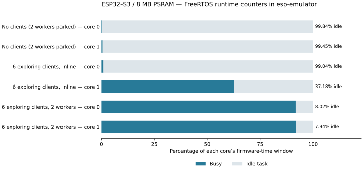

# S3 CPU and idle-time profile

Captured on 2026-10-07 using ESP-IDF **5.5.5**, esp-emulator **0.48.0**, and
`esp32s3-8`: two 240 MHz cores, 8 MB octal PSRAM at 80 MHz, 8 MB flash,
WiFi/user networking and a fresh 512 MiB Python NBD world per scenario. No browser
or QEMU ran during measurement. These are emulator results; physical S3 timing
has not been measured.



| Workload | Firmware window | Core 0 busy | Core 0 idle | Core 1 busy | Core 1 idle |
|---|---:|---:|---:|---:|---:|
| No clients (2 workers parked) | 20.010 s | 0.16% | 99.84% (19.977 s) | 0.55% | 99.45% (19.899 s) |
| 6 exploring clients, inline | 20.010 s | 0.96% | 99.04% (19.817 s) | 62.82% | 37.18% (7.440 s) |
| 6 exploring clients, 2 workers | 20.010 s | 91.98% | 8.02% (1.604 s) | 92.06% | 7.94% (1.588 s) |

Each percentage uses that core’s own elapsed time as 100%. Whole-chip busy
percentage is the mean of the two core busy percentages.

With two workers, seven of the ten two-second intervals were about 99% busy on
both cores. The interval 14–16 seconds into the window fell to 32.73% / 33.82%
busy, accounting for most of the observed idle time. Its cause was not isolated;
the 92% averages should not be read as a constant 8% of spare capacity.

## Where CPU time went

The Minecraft task is pinned to core 1. Worker 0 is pinned to core 0 and
worker 1 to core 1. Workers run at priority 1; the server runs at priority 3.
The two-worker workload consumes spare time on both cores while allowing
the server and network tasks to preempt the workers.

| Task (percentage of one core) | No clients | 6 clients, inline | 6 clients, 2 workers |
|---|---:|---:|---:|
| `minecraft` | 0.54% | 62.19% | 9.70% |
| `mcworker0` | 0.00% | — | 89.78% |
| `mcworker1` | 0.00% | — | 80.63% |
| `wifi` | 0.01% | 0.84% | 2.05% |
| `tiT` | 0.01% | 0.65% | 1.74% |
| `esp_timer` | 0.05% | 0.05% | 0.05% |
| `cpu_profile` | 0.09% | 0.06% | 0.09% |

`tiT` is the unpinned lwIP TCP/IP task; its runtime is a single-core equivalent,
not a claim that it ran on a particular core. The sampling-task cost is
included in the CPU totals. Runtime accounting itself also adds context-switch overhead.

## Host cost and workload delivery

| Workload | Host wall time | Emulator host CPU | Firmware / host speed | Chunk packets delivered |
|---|---:|---:|---:|---:|
| No clients (2 workers parked) | 20.1 s | 19.0% | 0.997× | 0 |
| 6 exploring clients, inline | 147.4 s | 98.3% | 0.136× | 380 |
| 6 exploring clients, 2 workers | 304.3 s | 99.8% | 0.066× | 933 |

Host CPU comes from Linux `/proc` user+system process counters; 100% means
one host logical CPU. It excludes Node/NBD CPU. Host timing is a property
of this emulator run and host allocation, not physical ESP32 performance.

Each loaded scenario uses six connected creative-mode clients with physics
disabled, seed 42, generator v2 and view distance 4. After joins and a short
settling period, the clients start around (120, -120), spread in six directions
and move outward 16 blocks every two firmware seconds. Each loaded window
contains ten moves per player; both scenarios boot independent fresh worlds.
Chunk counts are delivered packets across clients, not unique generated chunks.

Post-window diagnostic snapshots (not averages over the CPU window):

- **6 exploring clients, inline:** `TPS 19.6, 13.8 ms/tick (max 177), max loop stall 270 ms, 10 wakeups/s, 18 overruns (21 ticks late, 0 skipped), heap 5816 KB, 204 chunks (1967 KB), 0 entities | jobs inline, queued 0/2/0/0, max wait 1856/1877/0/0 ms; 1 chunks pinned by jobs; last generate 32.0 ms, send 13.3 ms | nbd://192.168.4.1:10809/ (512 MiB) | 32 KB read, 1 KB written, 0 chunks saved, 0 loaded, 1 ms l`
  `Slowest loop: 270 ms: jobs 46 input 1 stream 178 output 45 (stream: snapshots 0, storage reads 175) (waiting for sockets 0, slowest job finish 0 [load], queue lock 0) | last 2 s: 10 wakeups/s, 18 overruns, 21 ticks late, 0 skipped; waits 20 (slept 14 ms): 0 timeouts, 20 wake(), 68 readable, 0 writable`
- **6 exploring clients, 2 workers:** `TPS 20.0, 2.8 ms/tick (max 4), max loop stall 8 ms, 115 wakeups/s, 0 overruns (0 ticks late, 0 skipped), heap 5543 KB, 204 chunks (2116 KB), 0 entities | 2 workers busy 77% 76%, queued 0/0/1/0, max wait 0/80/481/0 ms; 0 chunks pinned by jobs; last generate 34.4 ms, send 20.6 ms | nbd://192.168.4.1:10809/ (512 MiB) | 65 KB read, 4 KB written, 2 chunks saved, 0 loaded, 1 ms l`
  `Slowest loop: 8 ms: jobs 8 (waiting for sockets 0, slowest job finish 7 [load], queue lock 0) | last 2 s: 115 wakeups/s, 0 overruns, 0 ticks late, 0 skipped; waits 230 (slept 1828 ms): 0 timeouts, 40 wake(), 201 readable, 0 writable`

## Measurement and reproduction

The optional `MC_CPU_PROFILE` build enables 64-bit FreeRTOS runtime counters
backed by `esp_timer`. A task samples every two seconds. A brief IPC call
on core 1 forces current-task accounting before the snapshot; core 0 has
already switched into the sampler. Core idle time is the change in
`IDLE0`/`IDLE1` runtime; busy time is elapsed `esp_timer` time minus idle.
The analyzer verifies that all task deltas sum to two cores’ elapsed time
(within 1%), rejects regressing counters and deleted tasks, and keeps
unpinned task attribution separate. Actual task-accounting coverage was:

- No clients (2 workers parked): 99.999995%.
- 6 exploring clients, inline: 100.000007%.
- 6 exploring clients, 2 workers: 100.000002%.

Idle means FreeRTOS idle-task residency. Interrupt/kernel time is charged
according to FreeRTOS accounting, so this is not a cycle-accurate measurement
of electrical sleep or interrupt-only CPU cost. One run per scenario is
reported; these are workload samples rather than statistical confidence bounds.

An initial trace-only attempt showed trace timestamps diverging from firmware
`esp_timer` progress under load. The reported windows and utilization therefore
use firmware runtime counters. Traces are retained for supporting inspection.

On a Linux host, activate ESP-IDF and esp-emulator, then run:

```sh
node test/emulator_profile.js --board esp32s3-8 --seconds 20 --bots 6 \
  --out build/profiles/s3-new-run
python3 tools/emulator/summarize_profile.py build/profiles/s3-new-run
```

The separate image is `build/esp32s3-8-emulator-cpu-profile`. Normal builds
leave the sampling task and runtime statistics disabled. No gameplay,
network, worker-scheduling or storage behavior was changed for profiling.

Raw counters, measurement endpoints, serial logs, traces and `summary.json`
for this run are in `build/profiles/s3-runtime-20261007/` (ignored build artifacts).
Profiling ELF SHA-256: `213b4170f6eb382d9f248e536c166ca683be25cea2a5b168d9f3dae5d5a90af0`.

The subsequent [storage-thread comparison](STORAGE_IO.md) repeats the six-client,
two-worker scenario against the new I/O ownership model. The measurements above
remain the pre-storage-thread baseline.
