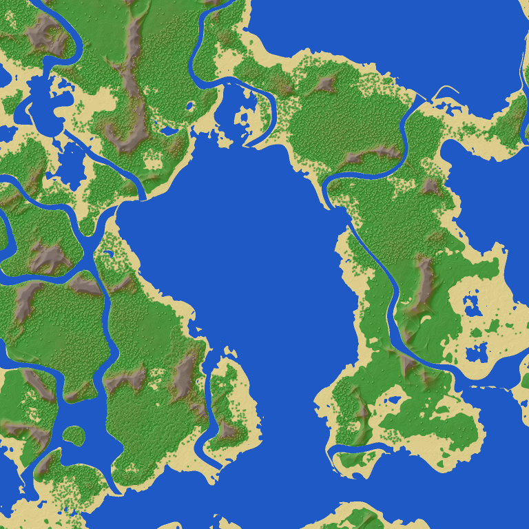
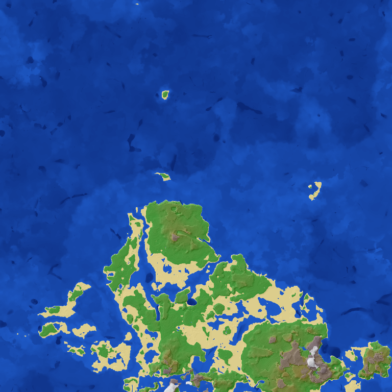

# Vanilla terrain generation on an ESP32: research and plan

Status: research, a measured prototype of the terrain shape, and a plan (October 2026).
Goal: worlds that look and play like vanilla 1.21.8 (all the biomes, the terrain shapes,
caves, features and structures), not a bit-identical copy of a vanilla world for the same
seed, on an ESP32-S3 (240 MHz, two cores, single-precision FPU, 8 MB PSRAM, 16 MB flash).

## Summary

- Vanilla's generator (1.18+) is mostly **data**: the 1.21.8 server jar's data pack holds
  the noise router (35 density function files, 60 noises), the surface rule, 65 biomes,
  carvers, 258 placed and 224 configured features, 34 structures with 188 template pools
  and 1,202 structure templates. A generator that runs this data looks like vanilla
  without copying vanilla's Java.
- **The terrain shape is feasible on the chip.** A prototype (`mc/world/vanilla`) compiles
  the 1.21.8 noise router into C and evaluates it in floats: vanilla's continents, ocean
  depths, mountains, archipelagos and caves. On the board one chunk took **1,300 ms** as a
  plain interpreter and **300-350 ms** after five optimisations; the next three should bring
  it to about **100 ms** per chunk per core (today's generator: 30-60 ms).
- It is **deterministic across the PC and the ESP32** (identical chunk fingerprints), as
  today's generator is: worlds stay the same on both.
- What is not data: the overworld's biome parameter table (`OverworldBiomeBuilder`, about
  7,600 points built by code), the feature implementations (trees, ores, geodes, ...),
  the hard-coded structures (strongholds, fortresses, mineshafts, monuments, mansions,
  temples, ...) and jigsaw assembly. These are ported, in that order of value.
- Flash: the structure templates are 6.2 MB as shipped (gzip NBT); re-encoded (palette
  and run lengths, only what the world needs) they fit a 2-3 MB data partition.

| Today's generator | The vanilla prototype (terrain shape only) |
|---|---|
|  |  |

*The same 1,536 x 1,536 blocks around the origin (seed 42), coloured by height: water
below sea level (darker: deeper), sand near it, then green, brown and white. Left: today's
generator (heights include water and trees). Right: the prototype's terrain shape, no
surface materials, no features yet. Rendered by `tools/worldgen/render_maps.js` from the
host test `vanilla_density_height_maps`.*

## How vanilla generates a chunk

A chunk passes through these statuses (`ChunkStatus`), each reading neighbours up to a
range:

1. **structure_starts / structure_references**: does a structure start in this chunk
   (structure sets: random spread with spacing/separation and salt, or concentric rings
   for strongholds), and which nearby starts reach into it.
2. **biomes**: a biome per 4 x 4 x 4 cell (quart), from six climate parameters sampled
   from the noise router (temperature, humidity/vegetation, continentalness, erosion,
   depth, weirdness), nearest point of the dimension's parameter list.
3. **noise**: the terrain. `final_density` at the corners of 4 x 8 x 4 cells, trilinear in
   between; stone where it is positive, else water below the aquifer's level, air above.
   Aquifers decide local water and lava levels underground; ore veins replace stone.
4. **surface**: the surface rule (a data-driven condition tree) replaces the top layers:
   grass and dirt, sand and sandstone, terracotta bands, snow, ice, mud, gravel, ...
5. **carvers**: classic caves and canyons cut afterwards (from chunks up to 8 away).
6. **features**: the biome's placed features in 11 steps (lakes, local modifications,
   underground structures, surface structures, strongholds, underground ores,
   underground decoration, fluid springs, vegetal decoration, top layer modification),
   each with placement modifiers (count, rarity, height range, in square, biome filter,
   surface/height map, ...).
7. **light, spawn**: light and initial mobs (this server does its own light already).

### The noise router (1.21.8 overworld, measured with `tools/worldgen/analyze_router.js`)

- Height 384 (y -64..319), cells 4 x 8 x 4: **1,225 corners per chunk** (5 x 49 x 5).
- `final_density`: 28 noises, up to **176 Perlin octave samples** per corner; many are
  cave branches skipped by `range_choice` (measured: ~55,000 octave samples per chunk).
- The 2D parts (continentalness, erosion, ridges, the offset/factor/jaggedness splines with
  430 points) are cached per 4 x 4 column (`flat_cache`, `cache_2d`).
- The 3D base terrain is the legacy `old_blended_noise` (8 + 16 + 16 octaves); caves are
  noise caves (cheese, spaghetti 2D/3D, noodles, pillars, entrances).
- Only 17 nodes of `final_density` are evaluated per block; the rest is interpolated.
- 219 density function nodes in all (a DAG), 118 splines, 27 noises (83 octaves).

## The prototype (`lib/mcore/src/mc/world/vanilla`)

- `tools/worldgen/compile_router.js` reads the data pack's noise router and writes
  `router_data.cpp` (nodes, splines, noise parameters) and `router_gen.cpp` (**the router
  as C code**: one function per node, constants inlined, memoised only where a node is
  shared).
- `density.cpp`: vanilla's algorithms in single-precision floats: `ImprovedNoise` (with
  vanilla's gradient table), `PerlinNoise` octaves, `NormalNoise`, the legacy
  `BlendedNoise` with its y smear, cubic splines (`CubicSpline.Multipoint`), every density
  function type the overworld uses, flat and 2D caches, cell interpolation as
  `NoiseChunk` does it. Not vanilla's seeding (Xoroshiro, positional random): the noises
  are vanilla's in shape and scale, the world for a seed is not vanilla's.
- Tests (`host/tests/test_vanilla_density.cpp`): plausible terrain (66% land, surfaces
  mostly y 50-80, mountains to y 176, caves, every climate parameter in vanilla's range),
  the approximations against the exact result, the generated code against the
  interpreter (identical), a fingerprint the board must match.
- On the board: `/vanillabench [chunks] [octave cut] [cell margin] [shared permutation]
  [generated]` (operator command; runs in its own thread, results in the log).

### Measured (8 chunks each; board: ESP32-S3 at 240 MHz, one core, idle server)

| Step | PC (ms/chunk) | Board (ms/chunk) | Blocks that differ from exact |
|---|---|---|---|
| Interpreter, exact | 13.6 | **1,300** | - |
| + memo arrays in internal RAM, cell-wise interpolation | 10.9 | 1,038 | 0 |
| + skip cells whose corners are all clearly solid or air (margin 0.1: 43-52% of cells) | 8.8 | 764 | 0.002% |
| + drop octaves weighing < 1/64 of their noise | 7.9 | 709 | 0.016% (surface height off by 0.04 on average) |
| + one permutation table for all octaves (internal RAM) | - | 629 | (distinct noises, not vanilla's values) |
| + `ImprovedNoise` without `floorf` and with a gradient switch (1.6 instead of 2.55 us per sample) | - | 566 | 0 |
| + the router compiled to C (`router_gen.cpp`) | 5.6 | 376 | 0 |
| + blocks written in memory order (layer by layer) | 5.6 | **300-350** | 0 |

Where the board's time goes now: ~180 ms for the corners (55,000 octave samples at
~1.6 us, plus the router), ~130-170 ms for the blocks in cells near a surface.

### The next optimisations (not done yet)

1. **Inline the per-block expression** (17 nodes) into one function: the block pass is
   still ~3.5 us per block for ~50,000 blocks. Expected: ~30-40 ms.
2. **Skip the air above the terrain**: vanilla computes all 384 blocks of every column,
   but above a column's preliminary surface (vanilla's `preliminarySurfaceLevel`, from
   `initial_density_without_jaggedness`) plus a margin everything is air. Most chunks
   have their surface between y 50 and 120: about half the corners. Expected: corners
   ~90 ms.
3. **Both cores**: chunks already generate on two worker threads; per-chunk cost stays,
   throughput doubles.

Target: **~100 ms per chunk per core** for the shape, ~50 ms of throughput with two
workers: close to today's generator (30-60 ms), so view distance and chunks/s stay usable.
Measured after each step with `/vanillabench` and `test/perf_suite.js`.

## The plan

Each phase is a branch, tested on the PC and the board, measured, and keeps the server
working; the old generator stays (generator version 2) until the new one is complete, and
new worlds choose it (`MC_GENERATOR 3`). Worlds are not converted.

**Phase 0: prerequisites.**
- The world height **-64..319** (the 1.21.8 migration's step 4): 24 sections, light,
  storage and the client's dimension type. Needed for vanilla's terrain (deep caves,
  mountains to y 256+).
- **Java 21** on the build machine to run vanilla's data generator
  (`java -DbundlerMainClass=net.minecraft.data.Main -jar server.jar --reports`): it dumps
  the overworld's **biome parameter list** (`reports/biome_parameters`), the one table that
  only exists as code, and the block report. Generated tables only; nothing of the jar is
  committed.

**Phase 1: terrain shape** (the prototype made production: the optimisations above,
chunks generated into sections directly, sea level water, lava below y -54; vanilla's
"no aquifers" mode first). Done when chunks/s and the loop stalls of `perf_suite.js` are
within 20% of today's generator. ~1 week.

**Phase 2: biomes.** The six climate parameters per quart (the 2D ones are already cached
per column), the parameter table from Phase 0 compiled into a search structure at build
time (an R-tree or a decision tree over the intervals: ~10-20 comparisons per lookup,
1,536 lookups per chunk: a few ms), 3D biomes (lush caves, dripstone caves, deep dark).
The client already has all 65 biomes (registries). ~3-4 days.

**Phase 3: surface rule.** `noise_settings/overworld.json`'s surface rule (30 KB of
JSON: conditions on biome, depth, noise, steepness, water, y) compiled like the router
(a small bytecode or C), plus the surface noises (badlands bands, ...). Then terrain looks
like vanilla's from above. ~3-4 days.

**Phase 4: aquifers and ore veins.** Vanilla's aquifer (local fluid levels from the
`fluid_level_*` and `barrier` noises, per 16 x 12 x 16 aquifer cell) and the copper/iron
ore veins (`vein_toggle`, `vein_ridged`, `vein_gap`). ~1 week.

**Phase 5: carvers.** Classic caves and canyons (`configured_carver`: 4), from chunks up to
8 away, deterministic per chunk. ~2-3 days.

**Phase 6: features.** The placement modifiers are data and generic (~15 types). The
feature types are code; by frequency in the data: ore (30), tree (39: trunk placers,
foliage placers, decorators: the largest piece), random patch / flower (33), selectors,
vegetation patches, springs, disks, lakes, block piles, freeze top layer, geodes, dripstone,
icebergs, ice spikes, huge mushrooms, fossils, monster rooms, ... ~2-3 weeks for the
common ones; the rare ones later.

**Phase 7: structures.**
- Placement for all structure sets (random spread, concentric rings: strongholds 1,408 to
  2,688 blocks from the origin, so the world border must allow them).
- Jigsaw structures from template pools and templates: villages (5 kinds), pillager
  outposts, bastions, ancient cities, trail ruins, trial chambers. Templates re-encoded at
  build time into a flash data partition (~2-3 MB), read through a small cache.
- The hard-coded ones, ported piece by piece: stronghold (needed for the End: the portal
  room), nether fortress (blaze rods), mineshafts, desert and jungle temples, swamp huts,
  igloos, ocean monuments and ruins, shipwrecks, ruined portals, buried treasure,
  woodland mansions, end cities.
- The beardifier (terrain smoothed under and around structures) and loot tables for
  their chests.
- ~4-6 weeks. Strongholds and fortresses first (they are on the way to the End).

**Phase 8: the Nether and the End** with their own routers (`noise_settings/nether.json`,
`end.json`): the same engine, their biomes (5 in the Nether), surface rules, features and
structures. ~1 week after Phases 1-7.

## Costs and risks

- **CPU**: the shape is the largest single cost and is measured above. Surface rules,
  biomes and carvers are expected at 10-20 ms together; features depend on the biome
  (forests are the worst case) and are measured per feature type as they come.
- **Memory**: the router's noises take ~60 KB of PSRAM (permutation tables; one shared
  table: 256 bytes in internal RAM); corner values ~25 KB per worker; structure assembly
  needs a bounded piece list per start.
- **Flash**: router code ~45 KB (measured), feature and structure code a few hundred KB,
  templates 2-3 MB in a data partition (16 MB flash: room).
- **Determinism**: chunks are a pure function of the seed and position on both the PC and
  the ESP32 (identical fingerprints measured); this has to hold for every phase (no
  fused multiply-add differences: built with the same flags, checked by fingerprints in
  the unit tests and on the board).
- **Not 1:1**: different seeding, float instead of double, dropped octaves: the same kind
  of world, not the same world as vanilla for a seed. Seed-based tools (chunkbase) do not
  apply.

## Files

- `tools/worldgen/analyze_router.js`: the router's structure and cost.
- `tools/worldgen/compile_router.js`: the router as tables and as C.
- `tools/worldgen/render_maps.js`: height maps as PNG.
- `lib/mcore/src/mc/world/vanilla/`: the prototype (`density.h`, `density.cpp`,
  `router_data.cpp`, `router_gen.cpp`).
- `host/tests/test_vanilla_density.cpp`: its tests and measurements.
